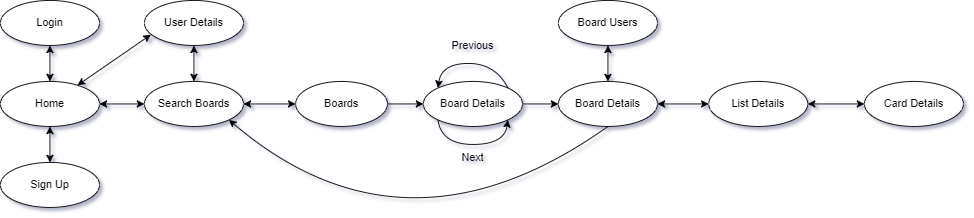

## Introduction

This document contains the relevant design and implementation aspects of LS project's, the development of a Trello-like application with a Web API and a Single Page Application served on a Cloud provider.

## Project Overview
The LS project aims to develop a robust system for managing boards, lists, and cards. This system allows users to collaborate and organize tasks efficiently.

Users can create the resources (Boards, lists...) which they can in turn share with other registered users of the service.

The live application can be found [here](https://service-ls-2223-2-41n-g05.onrender.com/).

## Modeling the database

### Conceptual model ###

The Entity-Relationship (ER) diagram below shows the conceptual model for the information managed by the system.

The conceptual model includes entities for users, boards, lists, and cards, each with their corresponding attributes.
Each board can be associated with one or several users, and each list must belong to a specific board.
Cards are always associated with a board and must belong to a list, except if they are archived.
The conceptual model has the following restrictions:

A card cannot be associated with multiple boards/lists.
A list must belong to one board only.

### Physical Model ###

The physical model of the database is available [here](../src/main/sql/createSchema.sql).

We highlight the following aspects of this model:

The schema defines tables for users, boards, lists, and cards, each with their corresponding columns and constraints.
Relationships between tables are enforced through foreign keys.

## Software organization

### Open-API Specification ###

To interact with the system, we have defined a comprehensive Open-API Specification. You can access it in the following formats:

* [As a JSON file](../open-api.json)
* [As a Postman documentation webpage](https://documenter.getpostman.com/view/26358395/2s93RRvsbv)

Certain endpoints require authorization using a bearer token to ensure secure access and identification.

### Request Details

Requests follow a RESTFUL architecture, where each endpoint corresponds to a specific action, such as creating a new user or retrieving a specific card.

Internally, requests are processed by relevant classes and functions.

Authorization is handled at the beginning of a request, prior to handing information to the service layer, using http4k's filter system. Implementation can be found and reviewed on [this Kotlin class](../src/main/kotlin/pt/isel/ls/webApi/Filters.kt) for more information.

### Connection Management
To utilize the database effectively, we rely on environment variables for configuration. Set the environment variable ``USE_POSTGRESQL`` to ``True`` to enable database usage. Otherwise, the system will utilize in-memory storage.

Connections are created based on a connection string stored as an environment variable under the name ``JDBC_DATABASE_URL``.

For correct handling of our connections, one is is created and managed using ``handleData`` of the ``DataContext`` in use.
In the case of PostgreSQL, this is implemented in [PgDataContext](../src/main/kotlin/pt/isel/ls/data/pgsql/PgDataContext.kt). This ensures that a single connection is used (in the scope of the function via ``.use``), ensuring automatic disposal of the connection once the scope exits and sane use and reuse of connections when possible.

If the work being done with the connection may alter the database in any way, transactions are handled by disabling the connection's ``autoCommit``. If any error occurs, we issue a ``rollback()`` and throw an exception to the calling function. In all other cases we issue a ``commit()`` and if needed the correct return value.

Requests go through the following elements of the solution:

Client sends a request to the server
Request is validated and authenticated
Request is processed by the appropriate class or function
Database is queried and data is returned to the class or function
Data is transformed and returned to the client

### Other
To indicate the service's listening port, set the environment variable ``PORT`` to the desired port number.

### Data Access

Data access is done through four main interfaces:

UsersData
BoardsData
ListsData
CardsData

Each interface provides CRUD operations via getById(), add(), delete(), and edit() functions. Additionally, each interface has entity-specific operations, such as getByEmail() or createToken() for Users.

Implementations were created for in-memory data storage and for PostgreSQL (located in data\mem and data\pgsql, respectively).

### Error Handling/Processing

Most of the error handling is done via the [TaskAppException](../src/main/kotlin/pt/isel/ls/TaskAppException.kt) and the enum [ErrorCodes](../src/main/kotlin/pt/isel/ls/utils/ErrorCodes.kt) which it uses.

These are then captured at the api level by the main filter, and a response is issued accordingly.

### Single page application

The flow of the application is as follows:

Via the Home view one can login or signup, creating an account on the server for further use.

Home can be accessed in all pages, by clicking the app name (LEIC Fauxllo).

## Critical Evaluation

